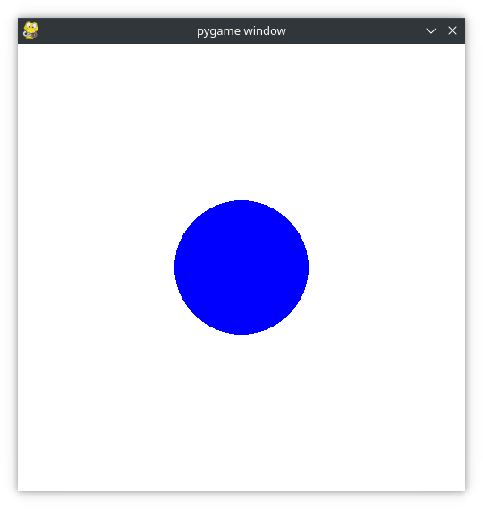

## 1. Introducció

PyGame és una llibreria de Python3 pensada per a desenvolupar de forma senzilla jocs amb Python. Anem a utilitzar-la per a desenvolupar un xicotet joc. Serà la primera activitat avaluable del curs.

## 2. Instal·lació i configuració

El primer que farem és activar el nostre entorn virtual de desenvolupament i instal·lar la llibreria pygame. Per a això recordeu que utilitzarem conda tal com ve explicat a la teoria. Dins l'entorn virtual instal·lem pygame.

```bash
$ conda activate ENTORN
(ENTORN) $ conda install -c conda-forge pygame
```

## 3. *Hola món!* del pygame 

Aquest programa crea una finestra, omple el fons de blanc i dibuixa un cercle blau al mig:

```py
# Simple pygame program

# Import and initialize the pygame library
import pygame
pygame.init()

# Set up the drawing window
screen = pygame.display.set_mode([500, 500])

# Run until the user asks to quit
running = True
while running:

    # Did the user click the window close button?
    for event in pygame.event.get():
        if event.type == pygame.QUIT:
            running = False

    # Fill the background with white
    screen.fill((255, 255, 255))

    # Draw a solid blue circle in the center
    pygame.draw.circle(screen, (0, 0, 255), (250, 250), 75)

    # Flip the display
    pygame.display.flip()enem
# Done! Time to quit.
pygame.quit()
```



Fixem-nos en alguns punts:

- La línia 8 configura la finestra de visualització del programa, amb unes dimensions de 500x500 pixels.

- Les línies 11 i 12 configuren un bucle de joc per controlar quan finalitza el programa.

- Les línies 15 a 17 recullen i gestionen esdeveniments dins del bucle del joc. L'únic esdeveniment gestionat de moment és pygame.QUIT, que es produeix quan l'usuari fa clic al botó de tancament de la finestra.

- La línia 20 omple la finestra d’un color sòlid. *screen.fill()* accepta una llista o una tupla que especifica els valors RGB del color. (255, 255, 255), és el color blanc.

- La línia 23 dibuixa un cercle a la finestra, utilitzant els paràmetres (finestra on dibuixar, color, posició central i radi)
- La línia 26 actualitza el contingut de la pantalla, que de moment no canvia al llarg del temps.
- La línia 29 ix del joc, sols s'executa quan ix del bucle per l'event QUIT.

Aquesta és la versió pygame de "Hola, món".
