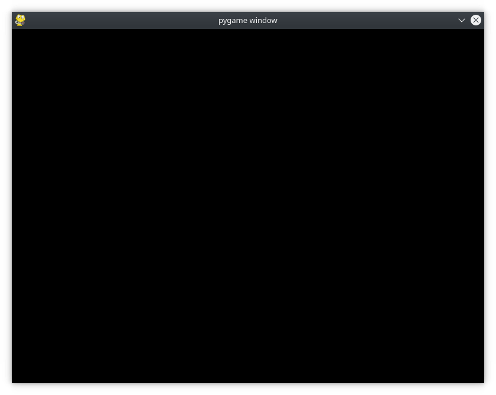

# Disseny del joc

Una vegada vist els conceptes bàsics anem a desenvolupar un xicotet joc a mode d'exemple. 

L'objectiu del joc és evitar obstacles que entren:

- El jugador comença a la part esquerra de la pantalla.
- Els obstacles entren a l'atzar per la dreta i es mouen a l'esquerra en línia recta.
- El jugador pot moure's cap a l'esquerra, cap a la dreta, cap amunt o cap avall per evitar els obstacles.
- El jugador no pot ixir-se'n de la pantalla.
- El joc finalitza quan el jugador és colpejat per un obstacle o quan l'usuari tanca la finestra. Mentre no es produisca açò, el joc continua, pot ser infinit.

## Importem i inicialitzem el joc

```py
# Import the pygame module
import pygame

# Import pygame.locals for easier access to key coordinates
# Updated to conform to flake8 and black standards
from pygame.locals import (
    K_UP,
    K_DOWN,
    K_LEFT,
    K_RIGHT,
    K_ESCAPE,
    KEYDOWN,
    QUIT
)

# Initialize pygame
pygame.init()
```

Utilitzem les constants definides en *locals* per veure quina tecla s'ha apretat, o si s'ha pulsat sobre l'aspa de tancar el programa.

## Configurem la pantalla

```py
# Define constants for the screen width and height
SCREEN_WIDTH = 800
SCREEN_HEIGHT = 600

# Create the screen object
# The size is determined by the constant SCREEN_WIDTH and SCREEN_HEIGHT
screen = pygame.display.set_mode((SCREEN_WIDTH, SCREEN_HEIGHT))
```
Definim una finestra és de 800x600, utilitzant les constants SCREEN_WIDTH i SCREEN_HEIGHT. El mètode ens torna una superfície que representa les dimensions interiors de la finestra. Aquesta és la part de la finestra que podem controlar, mentre que el sistema operatiu controla els límits de la finestra i la barra de títol.

Si executeu aquest programa ara, apareixerà una finestra que apareixerà breument i desapareixerà immediatament.

## Configuració del bucle principal del joc
Tots els jocs des de Pong fins a Fortnite utilitzen un bucle de joc per controlar-lo. Fa quatre coses molt importants:

1. Processa l'entrada de l'usuari
2. Actualitza l'estat de tots els objectes del joc
3. Actualitza la pantalla i l'àudio
4. Manté la velocitat del joc
   
Tots els cicles del bucle del joc s’anomenen fotogrames i, com més ràpid es facen les coses a cada cicle, més ràpid es desenvoluparà el vostre joc. Els fotogrames continuen ocorrent fins que es compleix alguna condició per ixir del joc. Al vostre disseny, hi ha dues condicions que poden acabar amb el bucle del joc:

1. El jugador xoca amb un obstacle. (Més endavant, cobrirà la detecció de col·lisions.)
2. El jugador tanca la finestra (esdeveniment QUIT).
   
El primer que fa el bucle del joc és processar l'entrada de l'usuari per permetre al jugador moure's per la pantalla. Per tant, necessiteu alguna manera de capturar i processar una gran quantitat d’informacions. Ho farem mitjançant el sistema d'esdeveniments pygame.

## Processament d'esdeveniments
Prémer una tecla, moure el ratolí o el joystick són algunes de les maneres en què un usuari pot proporcionar informació. Totes aquestes accions de l'usuari donen lloc a la generació d'un esdeveniment i poden passar en qualsevol moment.

Tots els esdeveniments de Pygame es col·loquen a la **cua d'esdeveniments**, la qual es pot accedir i manipular. El tractament que es fa dels esdeveniments s’anomena gestor d’esdeveniments.

Per al vostre joc, els tipus d’esdeveniments en què us centreu són les pulsacions de tecles i el tancament de la finestra. 

- Els esdeveniments de premuda de tecles tenen el tipus d'esdeveniment KEYDOWN.
- L'esdeveniment de tancament de finestra té el tipus QUIT. 

Els diferents tipus d'esdeveniments també poden tenir associades altres dades. Per exemple, el tipus d'esdeveniment KEYDOWN també té una variable anomenada *key* per indicar quina tecla s'ha premut.

Accediu a la llista de tots els esdeveniments actius a la cua cridant amb *pygame.event.get()*. A continuació, passeu per aquesta llista, inspeccioneu cada tipus d'esdeveniment i tracteu-los:

```py
# Variable to keep the main loop running
running = True

# Main loop
while running:
    # Look at every event in the queue
    for event in pygame.event.get():
        # Did the user hit a key?
        if event.type == KEYDOWN:
            # Was it the Escape key? If so, stop the loop.
            if event.key == K_ESCAPE:
                running = False

        # Did the user click the window close button? If so, stop the loop.
        elif event.type == QUIT:
            running = False
```

Vegem més a fons aquest bucle principal del joc:

1. S'estableix una variable de control per al bucle del joc. Per a ixir del bucle i del joc, hem d’establir la variable *running = False*.
2. Recorrem el gestor d'esdeveniments, recollint tots els esdeveniments que hi ha actualment a la cua d'esdeveniments. Si no hi ha esdeveniments, la llista està buida i el gestor no farà res.
3. Per a cada esdeveniment de la cua, comprovem  el tipus. Si *event.type == KEYDOWN*, s'ha apretat alguna tecla. Si és així, comprovem quina tecla s'ha apretat mirant l'atribut *event.key*. Si la clau és la tecla Esc, indicada per K_ESCAPE, surt del bucle del joc configurant running = False.
4. Es fa una comprovació similar per al tipus d'esdeveniment *QUIT*. Aquest esdeveniment només es produeix quan l'usuari fa clic al botó de tancament de la finestra. L'usuari també pot utilitzar qualsevol altra acció del sistema operatiu per tancar la finestra.

Quan afegiu aquestes línies al codi anterior i l'executeu, veureu una finestra amb una pantalla en blanc o negre. La finestra no desapareixerà fins que no premeu la tecla Esc tanqueu la finestra amb el ratolí o combinació de tecles *Alt + F4*. (Comproveu-ho, però recordeu afegir *pygame.display.flip()* per a que pinte la pantalla al bucle).



## Pintant objectes a la pantalla

Al programa de mostra, hem dibuixat a la pantalla mitjançant dos mètodes:

- *screen.fill()* per omplir el fons
- *pygame.draw.circle()* per dibuixar un cercle
- 
Ara veurem una tercera manera de dibuixar a la pantalla: utilitzar una superfície *Surface*.

Una superfície és un objecte rectangular sobre el qual podem dibuixar, com un full de paper en blanc. La pantalla és una superfície i podeu crear els vostres propis objectes de superfície separats de la pantalla. Vegem com funciona:

```py
# Fill the screen with white
screen.fill((255, 255, 255))

# Create a surface and pass in a tuple containing its length and width
surf = pygame.Surface((50, 50))

# Give the surface a color to separate it from the background
surf.fill((0, 0, 0))
rect = surf.get_rect()
```

A la primera línia la pantalla s'omple de blanc. Després es crea una nova superfície de 50 píxels d'ample, 50 píxels d'alçada i s'assigna a *surf*. Ara surf és una superfície igual que la pantalla principal i l'omplim de negre. Accedim al seu rectangle subjacentmitjançant *get_rect()* per poder-ho utilitzar posteriorment.

## Ús de .blit () i .flip ()
El fet de crear una nova superfície no és suficient per veure-la a la pantalla. Per fer-ho, cal que col·loqueu la superfície sobre una altra superfície. El terme blit significa Block Transfer (Transferència de blocs) i *.blit()* és la forma de copiar el contingut d’una superfície a una altra. Només podeu copiar el contingut entre superfícies, però ja haviem dit que screen és una superfície. Vegem com dibuixem *surf* a la pantalla:

```py
# This line says "Draw surf onto the screen at the center"
screen.blit(surf, (SCREEN_WIDTH/2, SCREEN_HEIGHT/2))
pygame.display.flip()
```

La funció *blit* pren dos arguments:

1. La superfície a pintar
2. Les coordenades del vèrtex *top-left*

Per tant si ho volem pintar exactament al centre de la pantalla hauriem de restar la seua amplada i altura respectivament:

```py
# Put the center of surf at the center of the display
surf_center = (
    (SCREEN_WIDTH-surf.get_width())/2,
    (SCREEN_HEIGHT-surf.get_height())/2
)

# Draw surf at the new coordinates
screen.blit(surf, surf_center)
pygame.display.flip()
```

Recordeu fer la crida a la funció *flip* per a repintar el joc.
