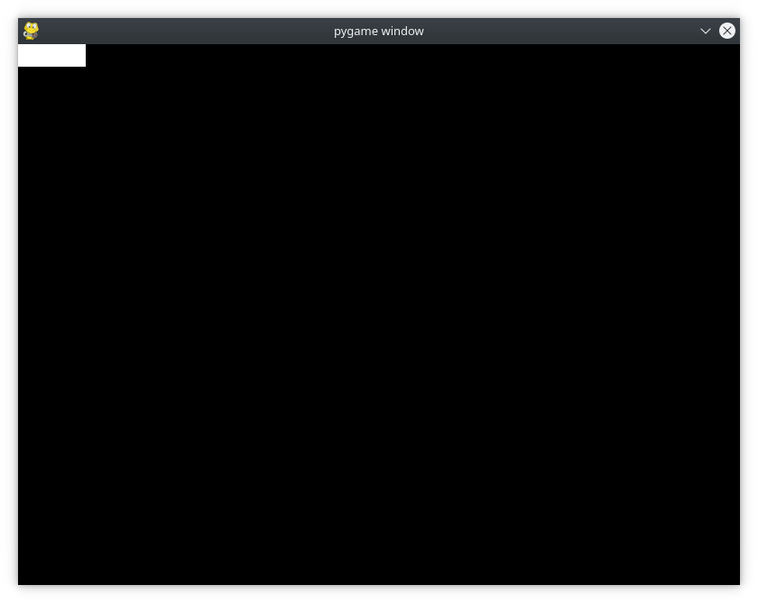
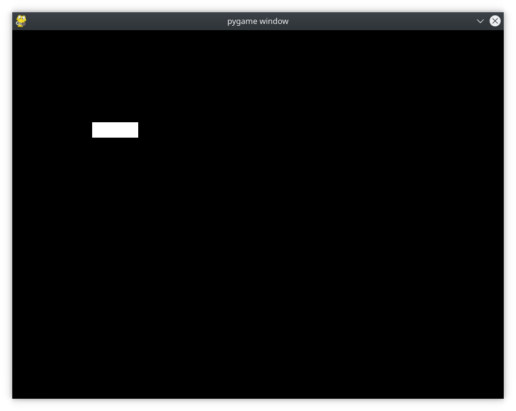
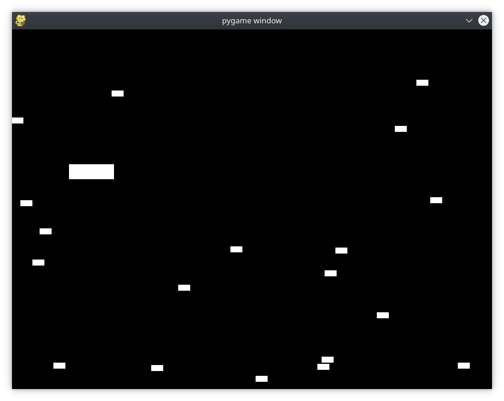

# Sprites
Al disseny del joc, el jugador comença per l’esquerra i els obstacles entren per la dreta. Podeu representar tots els obstacles amb objectes de la superfície per fer tot el dibuix més fàcil, però com sabeu on dibuixar-los? Com se sap si un obstacle ha xocat amb el jugador? Què passa quan l'obstacle ix de la pantalla? Què passa si voleu dibuixar imatges de fons que també es moguin? Què passa si voleu que les vostres imatges siguen animades? Podeu gestionar totes aquestes situacions i molt més amb els *sprites*.

En termes de programació, un sprite és una representació 2D d'alguna cosa a la pantalla. Essencialment, és una imatge. pygame proporciona una classe Sprite, que està dissenyada per contenir una o diverses representacions gràfiques de qualsevol objecte de joc que vulgueu mostrar a la pantalla. Per utilitzar-lo, creeu una nova classe que herede d'Sprite. Això us permet utilitzar els seus mètodes heredats.

## Jugadors
A continuació s’explica com s’utilitzen els objectes Sprite amb el joc actual per definir el jugador.

```py
# Define a Player object by extending pygame.sprite.Sprite
# The surface drawn on the screen is now an attribute of 'player'
class Player(pygame.sprite.Sprite):
    def __init__(self):
        super(Player, self).__init__()
        self.surf = pygame.Surface((75, 25))
        self.surf.fill((255, 255, 255))
        self.rect = self.surf.get_rect()
``` 

Primer definiu Player ampliant pygame.sprite.Sprite. Després *`.__ init __()`* utilitza *`.super()`* per cridar al constructor de la classe pare.

A continuació, definim i inicialitzem .surf per mantindre la imatge que voleu mostrar, que actualment és un quadre blanc. També definim i inicialitzem .rect, que s'utilitzarà més endavant. Per utilitzar aquesta nova classe, heu de crear un objecte nou i canviar també el codi de dibuix. Amplieu el bloc de codi següent per veure-ho tot junt:

```py
# Import the pygame module
import pygame

# Import pygame.locals for easier access to key coordinates
# Updated to conform to flake8 and black standards
from pygame.locals import (
    K_UP,
    K_DOWN,
    K_LEFT,
    K_RIGHT,
    K_ESCAPE,
    KEYDOWN,
    QUIT,
)

# Define constants for the screen width and height
SCREEN_WIDTH = 800
SCREEN_HEIGHT = 600

# Define a player object by extending pygame.sprite.Sprite
# The surface drawn on the screen is now an attribute of 'player'
class Player(pygame.sprite.Sprite):
    def __init__(self):
        super(Player, self).__init__()
        self.surf = pygame.Surface((75, 25))
        self.surf.fill((255, 255, 255))
        self.rect = self.surf.get_rect()

# Initialize pygame
pygame.init()

# Create the screen object
# The size is determined by the constant SCREEN_WIDTH and SCREEN_HEIGHT
screen = pygame.display.set_mode((SCREEN_WIDTH, SCREEN_HEIGHT))

# Instantiate player. Right now, this is just a rectangle.
player = Player()

# Variable to keep the main loop running
running = True

# Main loop
while running:
    # for loop through the event queue
    for event in pygame.event.get():
        # Check for KEYDOWN event
        if event.type == KEYDOWN:
            # If the Esc key is pressed, then exit the main loop
            if event.key == K_ESCAPE:
                running = False
        # Check for QUIT event. If QUIT, then set running to false.
        elif event.type == QUIT:
            running = False

    # Fill the screen with black
    screen.fill((0, 0, 0))

    # Draw the player on the screen
    #screen.blit(player.surf, (SCREEN_WIDTH/2, SCREEN_HEIGHT/2))
    screen.blit(player.surf, player.rect)

    # Update the display
    pygame.display.flip()
```



## Entrada d’usuari
Fins ara, hem après a configurar Pygame i dibuixar objectes a la pantalla. Ara comença la diversió. Fareu que el joc es puga controlar mitjançant el teclat.

Abans, haviem vist que *pygame.event.get()* retorna la llista dels esdeveniments de la cua, que analitzem per trobar els seus tipus. Bé, aquesta no és l’única manera de llegir les tecles. *pygame* també proporciona *pygame.event.get_pressed()*, que retorna un diccionari que conté tots els esdeveniments KEYDOWN actuals a la cua.

Posar-ho al bucle del joc després del bucle de gestió d'esdeveniments torna un diccionari que conté les tecles apretades al començament de cada fotograma.

A continuació, escrivim un mètode a Player per analitzar aquest diccionari. Això definirà el comportament del sprite a partir de les tecles que es premen.

```py
# Get the set of keys pressed and check for user input
pressed_keys = pygame.key.get_pressed()

# Move the sprite based on user keypresses
def update(self, pressed_keys):
    if pressed_keys[K_UP]:
        self.rect.move_ip(0, -5)
    if pressed_keys[K_DOWN]:
        self.rect.move_ip(0, 5)
    if pressed_keys[K_LEFT]:
        self.rect.move_ip(-5, 0)
    if pressed_keys[K_RIGHT]:
        self.rect.move_ip(5, 0)
```

K_UP, K_DOWN, K_LEFT i K_RIGHT corresponen a les tecles de les fletxes del teclat. Utilitzarem *.move_ip()*, que significa moure des del punt actual, i reb per paràmetre el número de pixels a moure's en horitzontal i en vertical com si es tractara d'un eix de coordenades.

A continuació, cridem a *.update()* cada fotograma per moure el sprite del jugador en resposta a les pulsacions de tecles.

```py
# Main loop
while running:
    # for loop through the event queue
    for event in pygame.event.get():
        # Check for KEYDOWN event
        if event.type == KEYDOWN:
            # If the Esc key is pressed, then exit the main loop
            if event.key == K_ESCAPE:
                running = False
        # Check for QUIT event. If QUIT, then set running to false.
        elif event.type == QUIT:
            running = False

    # Get all the keys currently pressed
    pressed_keys = pygame.key.get_pressed()

    # Update the player sprite based on user keypresses
    player.update(pressed_keys)

    # Fill the screen with black
    screen.fill((0, 0, 0))
```

Amb això, ja veiem que el Player es mou tant en horitzontal com en vertical.



És possible que noteu dos problemes:

1. El rectangle del jugador es mou molt ràpid. Ho solucionarem més endavant.
2. El rectangle del jugador pot ixir-se'n de la pantalla. Solucionem-ho ara.
   
Per mantenir el jugador a la pantalla, cal afegir la lògica per detectar les colisions entre el jugador i els límits de la pantalla. Per fer-ho, comprovem si les coordenades del rectangle s’han desplaçat més enllà del límit de la pantalla. Si és així, indiquem al programa que el torne a la vora, quedant la funció update com a continuació s'indica:

```py
# Move the sprite based on user keypresses
def update(self, pressed_keys):
    if pressed_keys[K_UP]:
        self.rect.move_ip(0, -5)
    if pressed_keys[K_DOWN]:
        self.rect.move_ip(0, 5)
    if pressed_keys[K_LEFT]:
        self.rect.move_ip(-5, 0)
    if pressed_keys[K_RIGHT]:
        self.rect.move_ip(5, 0)

    # Keep player on the screen
    if self.rect.left < 0:
        self.rect.left = 0
    if self.rect.right > SCREEN_WIDTH:
        self.rect.right = SCREEN_WIDTH
    if self.rect.top <= 0:
        self.rect.top = 0
    if self.rect.bottom >= SCREEN_HEIGHT:
        self.rect.bottom = SCREEN_HEIGHT
```

Ací, en lloc d’utilitzar *.move()*, només heu de canviar les coordenades corresponents de .top, .bottom, .left o .right directament. Proveu-ho i veureu que el rectangle del reproductor ja no pot ixir-se'n de la pantalla.

## Enemics

Què és un joc sense enemics? Utilitzarem les mateixes tècniques que ja hem après per crear una classe enemiga bàsica i, a continuació, crearem moltes instàncies d'aquesta per a que el jugador intente evitar-les. Primer, importeu la llibreria *random*. 
A continuació, creeu una nova classe de *sprite* anomenada *Enemy*, seguint el mateix patró que utilitzarem per a *Player*:

```py
# Import random for random numbers
import random

# Define the enemy object by extending pygame.sprite.Sprite
# The surface you draw on the screen is now an attribute of 'enemy'
class Enemy(pygame.sprite.Sprite):
    def __init__(self):
        super(Enemy, self).__init__()
        self.surf = pygame.Surface((20, 10))
        self.surf.fill((255, 255, 255))
        self.rect = self.surf.get_rect(
            center=(
                random.randint(SCREEN_WIDTH + 20, SCREEN_WIDTH + 100),
                random.randint(0, SCREEN_HEIGHT),
            )
        )
        self.speed = random.randint(5, 20)

    # Move the sprite based on speed
    # Remove the sprite when it passes the left edge of the screen
    def update(self):
        self.rect.move_ip(-self.speed, 0)
        if self.rect.right < 0:
            self.kill()
```

Hi ha quatre diferències notables entre Enemic i Jugador:

1. Quan creem un enemic ho fem a una ubicació aleatòria al llarg de la vora dreta de la pantalla. Es troba en una posició entre 20 i 100 píxels de distància de la vora dreta i en algun lloc entre la vora superior i la inferior. De forma que al principi no serà visible i anirà apareixent per la vora dreta de la pantalla.
2. Definim una velocitat *speed* com un número aleatori entre 5 i 20. Això especifica la velocitat amb què aquest enemic es mou cap al jugador.
3. *.update()* no necessita arguments, ja que els enemics es mouen automàticament cap a l'esquerra a la velocitat aleatòria definida quan es va crear i que ja no canvia.
4. Comprovem si l'enemic s'ha mogut fora de la pantalla al sobrepassar la vora esquerra. Per assegurar-nos que l’enemic estiga completament fora de la pantalla i que no desaparega mentre encara siga visible, comprovem que el costat dret de .*rect* haja sobrepassat el costat esquerre de la pantalla. Una vegada que l'enemic es troba fora de pantalla, cridem a *.kill()* per evitar anar consumint més recursos cada vegada.

Què fa *.kill()*? Per saber-ho, estudiem els *Sprite Groups*.

# Sprite Groups
Una altra classe súper útil que proporciona Pygame són els *Sprite Groups*. Es tracta d'un objecte que conté un grup d'objectes Sprite. Aleshores, per què utilitzar-lo? No podem fer el seguiment dels nostres objectes Sprite en una llista? Bé, podem, però l’avantatge d’utilitzar un grup radica en els mètodes que exposa. Aquests mètodes ajuden a detectar si algun enemic ha xocat amb el jugador, cosa que facilita les actualitzacions.

Vegem com crear *Sprite Group*. Creem dos objectes de grup diferents:

1. El primer grup tindrà tots els Sprite del joc.
2. El segon grup tindrà només els objectes enemics.
   
A continuació, es mostra el codi:
```py
# Create the 'player'
player = Player()

# Create groups to hold enemy sprites and all sprites
# - enemies is used for collision detection and position updates
# - all_sprites is used for rendering
enemies = pygame.sprite.Group()
all_sprites = pygame.sprite.Group()
all_sprites.add(player)

# Variable to keep the main loop running
running = True
```

Quan cridem el mètode *.kill()*, el Sprite s’elimina de tots els grups als quals pertany. Això també elimina les referències al Sprite, cosa que permet al *garbage collector* de Python recuperar la memòria quan siga necessari.

Ara que teniu un grup all_sprites, podeu canviar la manera com es dibuixen els objectes. En lloc de cridar a *.blit()* només amb Player, podem repintar tot sobre all_sprites:

```py
# Fill the screen with black
screen.fill((0, 0, 0))

# Draw all sprites
for entity in all_sprites:
    screen.blit(entity.surf, entity.rect)

# Flip everything to the display
pygame.display.flip()
```
Ara, qualsevol objecte d'*all_sprites* es redibuixarà a tots els fotogrames, ja sigui un enemic o un jugador.

Només hi ha un problema ... No tenim cap enemic. Podriem crear un munt d’enemics al principi del joc, però el joc es tornaria complicadíssim a l'apareixer tots junts. En el seu lloc, explorem com mantenir un subministrament constant d’enemics que arriben a mesura que avance el joc.

# Esdeveniments personalitzats

El disseny demana que apareguen enemics a intervals regulars. Això significa que, a intervals establerts, hem de fer dues coses:

1. Crea un enemic nou.
2. Afegiu-lo a all_sprites i a enemics. (Sprite Groups)
   
Ja teniu codi que gestiona esdeveniments aleatoris. El bucle d'esdeveniments està dissenyat per buscar esdeveniments aleatoris que es produeixen a cada fotograma i tractar-los adequadament. Per sort, pygame no us limita a utilitzar només els tipus d’esdeveniments que té predefinits. Podeu definir els vostres propis esdeveniments per gestionar-los segons convinga.

Vegem com es crea un esdeveniment personalitzat que es genera cada pocs segons. Podeu crear un esdeveniment personalitzat com es mostra a continuació:

```py
# Create the screen object
# The size is determined by the constant SCREEN_WIDTH and SCREEN_HEIGHT
screen = pygame.display.set_mode((SCREEN_WIDTH, SCREEN_HEIGHT))

# Create a custom event for adding a new enemy
ADDENEMY = pygame.USEREVENT + 1
pygame.time.set_timer(ADDENEMY, 250)

# Instantiate player. Right now, this is just a rectangle.
player = Player()
```

pygame defineix els esdeveniments internament com a enters, de manera que cal definir un nou esdeveniment amb un enter únic. L'últim esdeveniment reservat a Pygame es diu *USEREVENT*, de manera que definir *ADDENEMY = pygame.USEREVENT + 1* garanteix que siga únic.

A continuació, heu d'insertar aquest nou esdeveniment a la cua d'esdeveniments a intervals regulars durant tot el joc. Necessitem d'alguna forma gestionar el temps, per això utilitzarem el mòdul de temps. 

Disparem el nou esdeveniment ADDENEMY cada 250 mil·lisegons, o quatre vegades per segon. Per això farem una crida a [*.set_timer()*](https://www.kite.com/python/docs/pygame.time.set_timer) fora del bucle del joc, ja que només necessitem un temporitzador, però es dispararà durant tot el joc cada 250 milisegons.

Afegim el codi per gestionar el nostre nou esdeveniment.

```py
# Main loop
while running:
    # Look at every event in the queue
    for event in pygame.event.get():
        # Did the user hit a key?
        if event.type == KEYDOWN:
            # Was it the Escape key? If so, stop the loop.
            if event.key == K_ESCAPE:
                running = False

        # Did the user click the window close button? If so, stop the loop.
        elif event.type == QUIT:
            running = False

        # Add a new enemy?
        elif event.type == ADDENEMY:
            # Create the new enemy and add it to sprite groups
            new_enemy = Enemy()
            enemies.add(new_enemy)
            all_sprites.add(new_enemy)

    # Get the set of keys pressed and check for user input
    pressed_keys = pygame.key.get_pressed()
    player.update(pressed_keys)

    # Update enemy position
    enemies.update()
```

Sempre que el gestor d'esdeveniments veu el nou esdeveniment ADDENEMY, crea un enemic i l'afegeix a *enemies* i a *all_sprites*. Com que *Enemy* està en *all_sprites*, es dibuixarà a cada fotograma. També heu de cridar a *enemies.update()*, que actualitza totes les posicions dels enemics.



# Detecció de col·lisions
El disseny del joc demana que finalitze el joc sempre que un enemic xoque amb el jugador. La comprovació de col·lisions és una tècnica bàsica de programació de jocs i, en general, requereix alguns càlculs matemàtics per determinar si dos sprites se superposaran.

Aquí és on resulta útil un *framework* com Pygame. Escriure un codi de detecció de col·lisions és tediós, però Pygame té MOLTS mètodes de detecció de col·lisions disponibles per utilitzar-los.

Per a aquest tutorial, utilitzeu un mètode anomenat *.spritecollideany()*, que detecta qualsevol col·lisió entre un *sprite* i els *sprites* d'un grup. Accepta un Sprite i un Grup com a paràmetres. Comprova les superposicions entre tots els *.rect* del grup i el *.rect* de l'sprite. Si és així, torna True, és a dir si detecta col·lisió. En cas contrari, torna False. Això s'ajusta perfectament a aquest joc, ja que hem de comprovar si un sol jugador xoca amb un grup d'enemics.

Vegem el codi:

```py
# Draw all sprites
for entity in all_sprites:
    screen.blit(entity.surf, entity.rect)

# Check if any enemies have collided with the player
if pygame.sprite.spritecollideany(player, enemies):
    # If so, then remove the player and stop the loop
    player.kill()
    running = False
```

Es comprova si el jugador ha xocat amb algun enemic. Si és així, es crida a *player.kill()* per eliminar-lo de tots els grups als quals pertany. Com que els únics objectes que es representen es troben en *all_sprites*, el jugador ja no es renderitzarà. Una vegada que el jugador haja perdur, també haurem d'eixir del joc, de manera que configureu *running = False* per ixir del bucle del joc.

# Velocitat del joc

En provar el joc, potser vos haureu adonat que els enemics es mouen massa ràpid. Si no, tranquils, ja que el joc s'executarà a diferents velocitats segons el hardware subjacent, el sistema operatiu, etc.

La raó d'això és que el bucle del joc processa els fotogrames tan ràpidament com el processador i l'entorn ho permeten. Com que tots els sprites es mouen una vegada per fotograma, es poden moure centenars de vegades cada segon. El nombre de fotogrames que es manegen cada segon s’anomena velocitat de fotogrames (*frame rate*), un terme molt utilitzat pels gamers. Aconseguir-ne un adequat és la diferència entre un joc jugable i un altre que no ho és.

Normalment, volem una freqüència de fotogrames el més alta possible, per poder apreciar el major nombre de detalls, però, per a aquest joc, cal reduir-lo un poc perquè el joc es puga jugar. Afortunadament, el mòdul de temps de Python conté un rellotge dissenyat exactament per a aquest propòsit.

L’ús del rellotge per establir una velocitat de fotogrames reproduïble requereix només dues línies de codi. El primer crea un rellotge nou abans que comence el bucle del joc. Després utilitzem la funció *.tick()* per informar a pygame que el programa ha arribat al final del fotograma.

```py
# Setup the clock for a decent framerate
clock = pygame.time.Clock() 

...

# Our main loop
while running:
    
    ...
    

    # Flip everything to the display
    pygame.display.flip()

    # Ensure program maintains a rate of 30 frames per second
    clock.tick(30)
```
L'argument passat a *.tick()* estableix la velocitat de fotogrames desitjada. Per fer-ho, es calcula el nombre de mil·lisegons que ha de tardar cada fotograma, en funció de la velocitat de fotogrames desitjada. A continuació, compara aquest nombre amb el nombre de mil·lisegons que han passat des de la darrera vegada que es va cridar *.tick()*. Si no ha passat prou temps, retarda el processament per assegurar-se que mai no supera la velocitat de fotogrames especificada.

Si es passa una freqüència de fotogrames més xicoteta, transcorrerà més temps entre fotogrames, mentre que una freqüència de fotogrames més gran proporcionarà un joc més suau (i més ràpid).

En aquest moment, tenim un joc totalment funcional i jugable.
