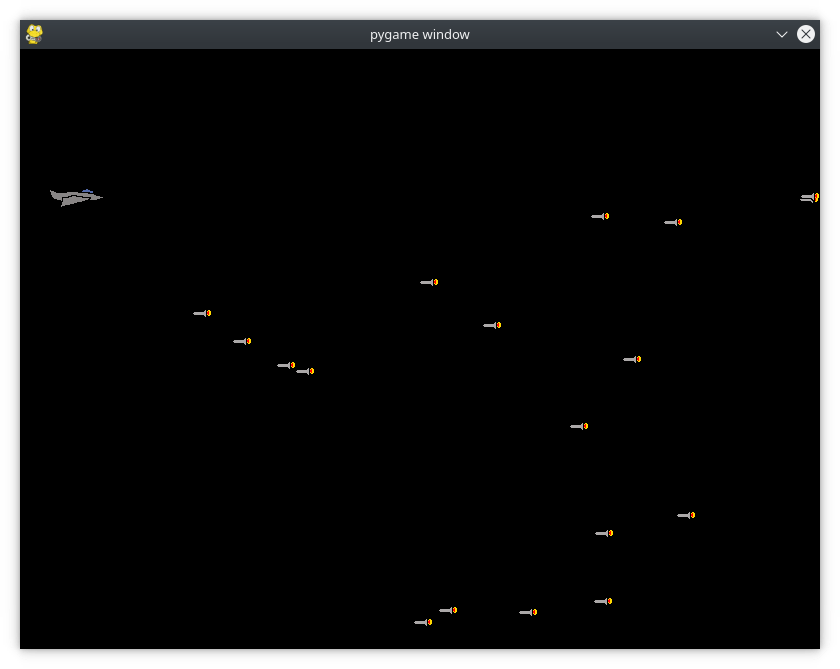
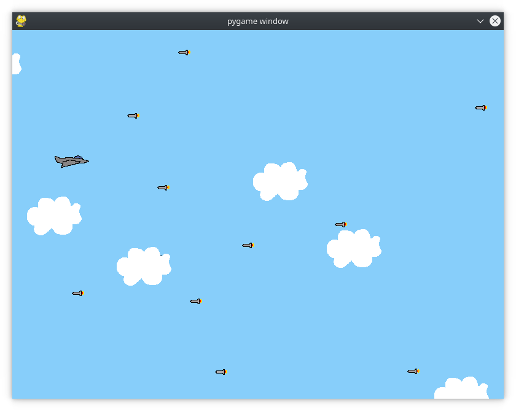

# Imatges dels *Sprites*

Molt bé, tens un joc, però siguem sincers ... L'aspecte no és massa amigable. El jugador i els enemics són només blocs blancs sobre fons negre. Va ser una revolució quan va aparèixer el Pong el 1972, però ha quedat antiquat. Anem a substituir aquests rectangles blancs per unes imatges que faran el joc més amigable.

Anem a carregar una imatge d'un avió per al jugador i alguns míssils per als enemics, encara que podeu utilitzar altres per personalitzar el vostre joc.

## Alteració dels constructors d'objectes
Abans d’utilitzar imatges per representar el jugador i els sprites enemics, hem de fer alguns canvis als seus constructors. El codi següent substitueix el codi utilitzat anteriorment.

```py
class Player(pygame.sprite.Sprite):
    def __init__(self):
        super(Player, self).__init__()
        self.surf = pygame.image.load("resources/jet.png").convert()
        self.surf.set_colorkey((255, 255, 255), RLEACCEL)
        self.rect = self.surf.get_rect()
```

Amb *pygame.image.load()* carreguem una imatge del disc. Li passem com a argument el path a l'arxiu. Retorna una superfície i la crida *.convert()* optimitza la superfície, fent que les futures crides al mètode *.blit()* siguen més ràpides.

Amb *.set_colorkey()* indiquem quin color es farà transparent. En aquest cas, triem el blanc, perquè és el color de fons de la imatge. La constant RLEACCEL és un paràmetre opcional que ajuda a renderitzar pygame més ràpidament en pantalles no accelerades. Per poder utilitzar esta constant, necessitem importar-la a la declaració d’importació de pygame.locals del principi del codi.

No hem de canviar res més, la imatge continua sent una superfície, tret que ara hi ha una imatge pintada. 

Farem el mateix al constructor d'enemic, esta vegada carregant la imatge *resources/missile.png*.



## Afegir imatges de fons
Afegirem ara uns núvols com a imatges de fons, utilitzant els mateixos passos que per a Player i Enemy:

1. Creem la classe Cloud.
2. Afegim la imatge d’un núvol.
3. Creem un mètode *.update()* que mou el núvol cap a la part esquerra de la pantalla 5 píxels en cada fotograma.
4. Creem un gestor i un esdeveniment personalitzats per crear objectes de núvol nous a un interval de temps definit de 1000ms.
5. Afegim els objectes de núvols creats a un grup nou anomenat núvols.
6. Actualitzem i dibuixem els núvols al bucle principal del joc.

Tingueu en compte que cada núvol i enemic nous s’afegeixen a *all_sprites*, mentre que els núvols ho fan al grup *clouds* i els enemics a *enemies*. Perquè?

- El renderitzat (repintat) es fa amb all_sprites.
- Les actualitzacions de posició es fan a núvols i enemics.
- La detecció de col·lisions es fa entre el jugador i enemics, però no amb núvols, ja que un avió pot atrevessar núvols sense problemes.

Per últim canvieu el color de fons del negre a (135, 206, 250).


