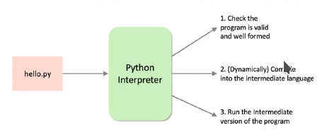

## 1. Què és Python?


Python és un llenguatge de propòsit general, al igual que Java o C. El seu ús ha augmentat durant els últims temps gràcies a:

- La seua flexibilitat i simplicitat, que el fan fàcil d'aprendre
- El seu ús extens en camps com el "Data Science", la IA i l'aprenentatge de programació.
- Llenguatge d'scripting d'alt nivell.
- Multiplataforma.
- Gran quantitat i varietat de llibreries. Web frameworks, clients correu, gestors de contingut, concurrència, generació de documents, gràfics, intel·ligència artificial, ...
- Lliure!! Mantés per la  Python Software Foundation

### 1.1. Execució de Python



### 1.2. Perquè Python

El llenguatge de programació Python és una opció cada vegada més utilitzada per principiants com per desenvolupadors experimentats. Flexible i versàtil, Python té punts forts en scripts, automatització, anàlisi de dades, aprenentatge automàtic i desenvolupament de back-end. Publicat per primera vegada el 1991 amb un nom inspirat en el grup de comèdia britànic Monty Python, l’equip de desenvolupament volia fer de Python un llenguatge divertit d’utilitzar.

C és el llenguatge de programació més popular a l’índex TIOBE, mentre que Python és el llenguatge més buscat a l’índex PYPL. Python i Java segueixen de prop a C al TIOBE. A PYPL, la diferència és més gran, ja que Python, que ocupa el primer lloc, supera en un 12% a Java, que ocupa el segon lloc.

Aquest curs, aprendrem a utilitzar Python i el framework Qt per desenvolupar aplicacions amb interfície d'usuari.

## 2. Instal·lació de Python 3/Miniconda

Per a instal·lar Python3 instal·larem [miniconda](https://docs.conda.io/projects/miniconda/en/latest/miniconda-install.html), la versió mínima d'Anaconda. Anaconda és una distribució de Python que inclou molts paquets i biblioteques preinstal·lats. A més, presenta alguns avantatges front a la instal·lació de l'intèrpret a través del sistema:

1. **Gestió d'entorns**: Permet crear i gestionar entorns virtuals, que són entorns de Python aïllats que poden tindre les seves pròpies versions de Python i paquets instal·lats. Això facilita la gestió de dependències i la compatibilitat entre projectes.

2. **Gestió de paquets**: Proporciona una forma convenient d'instal·lar, actualitzar i desinstal·lar paquets de programari i biblioteques.

3. **Facilitat d'ús**: És fàcil d'instal·lar i configurar en qualsevol sistema operatiu, incloent Windows, macOS i Linux.

4. **Personalització**: A diferència d'Anaconda, que inclou una gran quantitat de paquets preinstal·lats, Miniconda ofereix un sistema mínim que permet triar i afegir només els paquets que necessitem per al nostre projecte, la qual cosa pot ajudar a reduir l'espai en disc i la complexitat.
   
5. **Reproductibilitat**: és possible configurar tot un entorn de desenvolupament i exportar-lo a un altre sistema de forma molt ràpida.

Ací teniu el [CheatSheet de la última versió de conda](https://conda.io/projects/conda/en/latest/_downloads/a35958a2a7fa1e927e7dfb61ebcd69a9/conda-4.14.pdf).

### 2.1. Ús de Conda i entorns virtuals de desenvolupament

Un entorn virtual és un entorn aïllat de Python que es crea utilitzant l'eina de gestió de paquets Conda. Aquests entorns virtuals permeten als desenvolupadors crear espais separats pels seus projectes, la qual cosa els permet gestionar les dependències de manera eficient i garantir que cada projecte tinga el seu propi conjunt de biblioteques i paquets sense interferir amb altres projectes ni amb la configuració del sistema.

Una vegada instal·lat miniconda, veureu que per defecte activa un entorn virtual anomenat *base* en obrir el vostre terminal, ja que ens apareix `(base)` al nostre prompt.

Per crear, activar i desactivar els entorns de desenvolupament utilitzarem les següents ordres:

```bash
$ conda create --name ENVNAME
$ conda activate ENVNAME
$ conda deactivate
```

!!! tip "Gestió d'entorns virtuals amb vscode"
    Podeu utilitzar [Python Environment Manager de Don Jayamanne](https://marketplace.visualstudio.com/items?itemName=donjayamanne.python-environment-manager) per gestionar de forma visual els vostres entorns.

!!! danger "Ús d'entorns de desenvolupament"
    Creeu-vos un entorn de desenvolupament per al mòdul. També haureu de crear-vos nous entorns per a cada projecte.

!!! tip "Desactivem l'activació de base per defecte"
    Si voleu que per defecte no s'active l'entorn virtual *base*, podeu executar la següent ordre al terminal (Anaconda Prompt en cas d'utilitzar Windows):

    ```bash
    $ conda config --set auto_activate_base false
    ```

!!! tip "Autocompletat amb el tabulador"
    L'autocompletat de conda no està actiu per defecte. Si voleu utilitzar l'autocompletat podeu instal·lar [conda-bash-completion](https://github.com/tartansandal/conda-bash-completion).

### 2.2. Ús de conda per a instal·lació de paquets

Ara podrem utilitzar conda per instal·lar paquets de Python3.

```bash
$ conda install PACKAGE
```

## 3. Modes d'execució

1. Interactiva a través de l'intèrpret

    ~~~bash
    ~$ python3
    Python 3.7.3 (default, Jul 25 2020, 13:03:44) 
    [GCC 8.3.0] on linux
    Type "help", "copyright", "credits" or "license" for more information.
    >>> 
    ~~~

2. Execució d'un fitxer Python

    ~~~bash
    ~$ python3 hola_mon.py
    Hola món
    ~~~

3. Execució d'un script

    ~~~bash
    hola_mon.py
    ---
    #!/usr/bin/env python3
    print("Hola món")
    ---

    ~$ chmod u+x hola_mon.py
    ~$ ./hola_mon.py
    Hola món
    ~~~

4. Des d'un Entorn de Desenvolupament IDE:

    En el cas de l'entorn de desenvolupament es recomana utilitzar Visual Studio Code. Instal·leu també l'extensió *Python* de Microsoft, que inclou autocompletat, depuració, formatació automàtica, proves...


### 3.1. Activitat 1

Implementa el "Hola món!" i executa-lo de les quatre formes possibles.


## 4. Paraules reservades i identificadors

### 4.1. Paraules reservades

No es poden utilitzar coma identificador de variables ni nom de funcions, ja que s'utilitzen per a definir la sintaxi i l'estructura d'un programa.
Les paraules reservades són:

|        |          |         |          |        |
| ------ | -------- | ------- | -------- | ------ |
| False  | await    | else    | import   | pass   |
| None   | break    | except  | in       | raise  |
| True   | class    | finally | is       | return |
| and    | continue | for     | lambda   | try    |
| as     | def      | from    | nonlocal | while  |
| assert | del      | global  | not      | with   |
| async  | elif     | if      | or       | yield  |

Per a obtindre la llista completa des de l'intèrpret:

~~~py
>>> import keyword
>>> print(keyword.kwlist)
~~~

### 4.2. Identificadors

Per convenció, els noms de les variables i funcions han de ser:

- combinacions de lletres minúscules i números
- començar per lletra
- descriptius (excepte en bucles o se sol utilitzar *i* i *j*)
- amb paraules separades per guió baix

Per exemple: nom_usuari, numero_telefon, cognom1, sumar(), ...

**Recorda que Python és un llenguatge *case sensitive***. Per tant Var i var no són el mateix identificador.

## 5. Instruccions i sagnat

### 5.1. Instruccions

L'intèrpret de Python va executant línia a línia cada instrucció. Si volem que una instrucció ocupe diverses línies ho hem d'indicar amb el caràcter \\.


Per exemple:

~~~py
>>> a = 1 + 2 + 3 + \
...     4 + 5 + 6 + \
...     7 + 8 + 9
>>> print(a)
45
~~~

La continuació de línia és implicita dins de parèntesis (), corxets [] i claus {}.

~~~py
colors = ['red',
          'blue',
          'green']
~~~

També podem posar diverses sentències en una línia:

~~~py
a = 1; b = 2; c = 3
~~~

### 5.2. Sagnat

La majoria de llenguatges de programació utilitzen les claus {} per a definir blocs de codi. En canvi, Python utilitza el sagnat (identation).

Un bloc de codi (cos d'una funció, bucle, etc.) comença amb sagnat i acaba amb la primera línia sense sagnat. Depèn de vosaltres la quantitat de sagnat, però ha de ser coherent en tot el bloc. Generalment, s’utilitzen quatre espais en blanc per a sagnat i es prefereixen a les tabulacions. El resultat és un codi net i clar.
Exemple:

~~~py
for i in range(1,11):
    print(i)
    if i == 5:
        break
~~~

Un sagnat incorrecte llança un *IndentationError*.

### 5.3. Comentaris

Els comentaris són molt importants en escriure un programa. Descriuen el que passa dins d’un programa, de manera que una persona que mira el codi font no tinga dificultats per entendre'l. A més, és possible que oblideu els detalls clau d'implementació del programa que acabeu d’escriure. Per tant, **invertir temps per explicar aquests conceptes en forma de comentaris sempre és fructífer**.

A Python, fem servir el símbol coixinet (#) per començar a escriure un comentari. 
S'estén fins al caràcter de línia nova. No cal que el comentari estiga a principi de línia, pot estar en mig.

Per fer comentaris multilínia, podem utilitzar el coixinet a principi de cada línia. També podem fer servir les cometes dobles o simples tres vegades.

Exemple:

~~~py
''' Comentari
multilínia'''
~~~

### 5.4. Docstrings

Una docstring és una abreviatura de text de documentació.

La documentació de Python són els textos que apareixen just després de la definició d'una funció, mètode, classe o mòdul.

S'utilitzen cometes triples durant l'escriptura de la documentació. 

Per exemple:

~~~py
def doble (num):
    """Funció per duplicar el valor"""
    return 2 * num
~~~

La documentació s’associa a l’objecte com a atribut __doc__.

Per tant, podem accedir a la documentació de la funció anterior amb les següents línies de codi:

~~~py
def doble (num):
    """Funció per duplicar el valor"""
    return 2 * num
print(doble.__ doc__)
~~~

~~~py
def suma_binaria(a, b):
    '''
    Torna la suma de dos enters en binari.

            Paràmetres:
                    a (int): Un enter
                    b (int): Altre enter

            Torna:
                    suma_binaria (str): String amb els digits binaris de la suma
    '''
    suma_binaria = bin(a+b)[2:]
    return suma_binaria


print(suma_binaria.__doc__)
~~~

## 6. Variables, constants i tipus

### 6.1. Variables

En Python, quan declarem una variable i li assignem un valor, realment estem creant un objecte i assignant un valor per referència.

~~~py
>>> num = 10
>>> type(num)
<class 'int'>
>>> num = 10.0
>>> type(num)
<class 'float'>
~~~

Podem inicialitzar múltiples variables en una mateixa línia, ja siga amb el mateix valor o diferent.

~~~py
a, b, c = 5, 3.2, "Hola"
x = y = z = "iguals"
~~~

### 6.2. Constants

A Python no existeixen les constants a l'estil de *static final* de Java, sinó que simplement es defineix una variable que no es modifica el valor. Normalment es definixen en un mòdul a banda, utilitzant majúscules i guió baix si és necessari, que s'importa a l'arxiu principal.

~~~py
constants.py
---
PI = 3.14

main.py
---
import constants.py
radi = 5
perimetre = 2 * constants.PI * radi
print(perimetre)
~~~

### 6.3. Tipus

L'assignació de tipus és dinàmica i pot canviar, per això no declarem els tipus de les variables. Per determinar el tipus d'un objecte, fem servir el mètode **type()**. Els tipus d'objecte definits a Python3 són:
1. Numèrics: 
   
   1.1. Integer

~~~py
    a = 0b1010 #Binary
    b = 100 #Decimal 
    c = 0o310 #Octal
    d = 0x12c #Hexadecimal
~~~

   1.2. Float

~~~py
    float_1 = 10.5 
    float_2 = 1.5e2
~~~

   1.3. Complex

~~~py
    x = 3 + 4j
~~~

2. Strings

~~~py
    nom = 'Ferran Cunyat'
~~~

Els principals mètodes sobre un string són **capitalize(), count(), find(), format(), lower(), replace(), split(), title(), translate(), upper()**.

3. Boolean

~~~py
    x = (1 == True) # True pren el valor numèric 1, mentre que False el 0
    y = (1 == False)
    a = True + 4
    b = False + 10
~~~

4. Especials (None)

S'utilitza per no donar-li valor a una variable.

~~~py
>>> x = None
>>> type(x)
<class 'NoneType'>
~~~

5. Col·leccions
   
   1. Llista

    Són una seqüència d'elements, no necessàriament del mateix tipus, encara que normalment si que ho són. Es definix amb corxets i els elements separats per comes.
    Podem accedir a un element o un rang i és mutable.

    ~~~py
        >>> a = [5,10,15,20,25,30,45,40]
        >>> print(a)
        [5, 10, 15, 20, 25, 30, 45, 40]
        >>> a[3] = "Ferran"
        >>> print(a[:4])
        [5, 10, 15, 'Ferran']
    ~~~

    Algunes de les principals funcions que podem aplicar sobre llistes són **apend(), clear(), copy(), extend(), insert(), remove(), reverse()**.

   2. Tupla
   
    Són una seqüència d'elements, no necessàriament del mateix tipus, però esta vegada immutable.

    ~~~py
        >>> tupla = (2,'hola')
        >>> tupla[1] = 'clavel'
        Traceback (most recent call last):
        File "<stdin>", line 1, in <module>
        TypeError: 'tuple' object does not support item assignment
    ~~~

    1. Rang
   
    Seqüència immutable de números, generalment utilitzada per a iterar sobre for o generar llistes ràpidament.

    ~~~py
        >>> list(range(0, 30, 5))
        [0, 5, 10, 15, 20, 25]
    ~~~

    3
    
    . Conjunt (Set)

    Col·lecció desordenada d'elements únics. Ja que és una llista desordenada, no la podem indexar i per tant accedir als elements segons la seua posició.

    ~~~py
    >>> a = {2,2,5,5,4,10,1,0}
    >>> print(a)
    {0, 1, 2, 4, 5, 10}
    >>> a[1]
    Traceback (most recent call last):
    File "<string>", line 301, in runcode
    File "<interactive input>", line 1, in <module>
    TypeError: 'set' object does not support indexing
    ~~~

    1. Diccionari

    Diccionari és una col·lecció no ordenada de parells valor-clau.

    Generalment s’utilitza quan tenim una gran quantitat de dades. Els diccionaris estan optimitzats per recuperar dades. Hem de conèixer la clau per recuperar el valor.

    A Python, els diccionaris es defineixen entre claus {} i cada element és un parell que adopta la forma de clau:valor. La clau i el valor poden ser de qualsevol tipus.

    ~~~py
        >>> d = {1:'valor','clau':2}
        >>> print(type(d))
        <class 'dict'>
        >>> print("d[1] = ", d[1]);
        d[1] =  valor
        >>> print("d['clau'] = ", d['clau']);
        d['clau'] =  2
        >>> print("d[2] = ", d[2]);
        Traceback (most recent call last):
        File "<stdin>", line 2, in <module>
        KeyError: 2
    ~~~

### 6.4. Activitat 2
Fixa't en el següent fragment de codi:

~~~py
>>> s = [1,2]
>>> r = s[:]
>>> s[0]=2
>>> print(s)
[2, 2]
>>> print(r)
???
>>> print(s)
???
~~~
Quina serà l'eixida? Per qué?


~~~py
>>> r = s
>>> s[0]= 5
>>> print(r)
???
>>> print(s)
???
~~~
I ara? Per qué?

### 6.5. Conversió entre tipus

#### 6.5.1. Conversió implícita

Són conversions que fa el mateix llenguatge automàticament. Per exemple:

~~~py
num_int = 123
num_flo = 1.23

num_nou = num_int + num_flo

print("num_int és de tipus:",type(num_int))
print("num_flo és de tipus:",type(num_flo))

print("Valor de num_nou:",num_nou)
print("num_nou és de tipus:",type(num_nou))
~~~

### 6.6. Conversió explícita

Utilitzem funcions predefinides per a forçar la conversió **int(), float(), str(), ...**.

### 6.7. Activitat 3

Quin és el resultat d'executar el següent fragment de codi?

~~~py
>>> enter = 123
>>> cadena = "456"
>>> suma = enter + cadena
~~~

Definix dues variables, una per a fer la suma entera (579) i l'altra per a concatrenar com a text (123456).

## 7. Entrada, eixida i import

### 7.1. Entrada

Ja hem vist que per a introduir informació per teclat utilitzem la funció **input([prompt])**. 

### 7.2. Eixida

Per a imprimir per ella utilitzarem la funció **print()**. 
Moltes vegades s'utilitza en combinació amb la funció **format()** dels strings.

~~~py
>>> x = 5; y = 10
>>> print('El valor d\'x és {} i el de y és {}'.format(x,y))
>>> # Fixeu-se que hem escapat el caracter '
El valor d'x és 5 i el de y és 10
>>> print('Hola {nom}, {salutacio}'.format(salutacio = 'Bon dia', nom = 'Pau'))
~~~
 
#### 7.2.1. Activitat 4
Implementa el programa "Hola món" utilitzant la funció format.

### 7.3. Import

Quan volem fer ús del codi d'un altre mòdul (.py), l'hem d'importar al programa actual amb **import**.

~~~py
>>> import math
>>> print(math.pi)
~~~

També podem importar sols alguna de les funcions o atributs amb **from**

~~~py
>>> from math import pi
~~~

En importar un mòdul, Python analitza diversos llocs definits a sys.path. És una llista de les ubicacions on buscar el mòdul.

~~~py
>>> import sys
>>> sys.path
['', '/usr/lib/python37.zip', '/usr/lib/python3.7', '/usr/lib/python3.7/lib-dynload', '/home/ferran/.local/lib/python3.7/site-packages', '/usr/local/lib/python3.7/dist-packages', '/usr/lib/python3/dist-packages']
~~~

Per a importar d'una altra carpeta, ho fem amb **from *paquet* import *modul***. Pots posar ubicacions absolutes o relatives.
Si volem importar un codi d'una ubicació que no està al path.

~~~py
>>> import sys
>>> sys.path.append('/path/a/la/carpeta')
~~~

## 8. Espai de noms i àmbit de variables

### 8.1. Noms

En Python, tot són objectes, inclús les funcions. Un nom és la forma d'accedir als objectes, i amb la funció **id()** podem veure la seua ubicació en memòria. Per exemple:

~~~py
>>> a = 2
>>>print('id(2) =', id(2))
id(2) = 9062656
>>>print('id(a) =', id(a))
d(a) = 9062656
~~~

#### 8.1.1. Activitat 5

Quin creus que serà el resultat a l'executar el següent fragment de codi?

~~~py
>>> a = 2
>>> print('id(a) =', id(a))

>>> a = a+1
>>> print('id(a) =', id(a))
>>> print('id(3) =', id(3))

>>> b = 2
>>> print('id(b) =', id(b))
>>> print('id(2) =', id(2))
~~~

### 8.2. Espais de noms (namespaces)

Els espais de noms a Python, són una col·lecció de noms. 

Diferents espais de noms poden coexistir, però estan completament aïllats.

Quan iniciem Python, es crea un espai de noms amb totes les funcions que l'intèrpret reconeix, **espai de noms predefinit**. Aquesta és la raó per la qual funcions integrades com id (), print () etc. sempre estan disponibles per a nosaltres des de qualsevol part del programa.

En canvi, cada mòdul crea el seu propi **espai de noms global**. Aquests espais de noms estan aïllats entre ells. Per tant, podem donar el mateix nom a objectes de mòduls diferents sense que entren en conflicte.

Els mòduls poden contindre funcions i classes. Quan es crida una funció, es crea un **espai de noms local** que té noms propis definits. Similar, és el cas de la classe. El següent diagrama pot ajudar a aclarir aquest concepte.


### 8.3. Àmbit de les variables

Tot i que hi ha diversos espais de noms definits, és possible que no puguem accedir a tots ells des de totes les parts del programa. El concepte d’àmbit entra en joc.

Sempre hi ha almenys tres àmbits definits.

1. Àmbit local a la funció amb nom locals
2. Àmbit del mòdul que té noms globals
3. Àmbit més extern que té noms predefinits


Quan es fa una referència dins d'una funció, el nom es busca a l'espai de noms local, després a l'espai de noms global i finalment a l'espai de noms predefinit.

Si hi ha una funció dins d’una altra funció, s’anida un nou àmbit dins de l'àmbit local.

#### 8.3.1. Activitat 6

Quin serà el resultat mostrat per consola a l'executar el següent fragment de codi?

~~~py
def funcio_externa():
    a = 20

    def funcio_interna():
        a = 30
        print('a =', a)

    funcio_interna()
    print('a =', a)


a = 10
funcio_externa()
print('a =', a)
~~~

#### 8.3.2. Activitat 7

Quin serà el resultat mostrat per consola a l'executar el següent fragment de codi?

~~~py
def funcio_externa():
    global a
    a = 20

    def funcio_interna():
        global a
        a = 30
        print('a =', a)

    funcio_interna()
    print('a =', a)


a = 10
funcio_externa()
print('a =', a)
~~~
